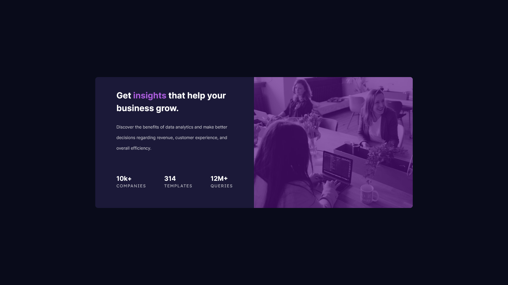

# Frontend Mentor - Stats preview card component solution

This is a solution to the [Stats preview card component challenge on Frontend Mentor](https://www.frontendmentor.io/challenges/stats-preview-card-component-8JqbgoU62). Frontend Mentor challenges help you improve your coding skills by building realistic projects. 

## Table of contents

- [Overview](#overview)
  - [The challenge](#the-challenge)
  - [Screenshot](#screenshot)
  - [Links](#links)
- [My process](#my-process)
  - [Built with](#built-with)
  - [What I learned](#what-i-learned)
- [Author](#author)

## Overview

### The challenge

Users should be able to:

- View the optimal layout depending on their device's screen size

### Screenshot

#### Mobile Design

#### Tablet Design

#### Desktop Design

### Links

- Solution URL: [Add solution URL here](https://your-solution-url.com)
- Live Site URL: [Link](https://cranky-wright-7f9a56.netlify.app/)

## My process

### Built with

- Semantic HTML5 markup
- SASS
- Flexbox
- Mobile-first workflow

### What I learned

- Use Image instead of background-image. I spend so much time to fix this project because I use background-image and it cause some bug and trouble

## Author

- Website - [Tin.Pham](https://github.com/tin-pham)
- Frontend Mentor - [@phambaohuy12345](https://www.frontendmentor.io/profile/phambaohuy12345)
- Facebook - [Tin Pham](https://www.facebook.com/joseph.webdev)

